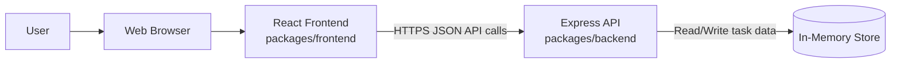
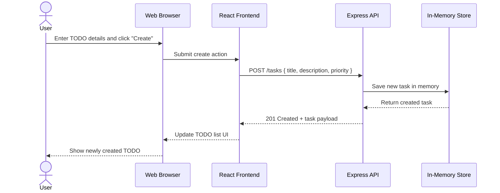

# Cloud Architecture Overview

This document provides a simple system context diagram for the monorepo application.

## Create TODO Sequence

## Notes

- The React frontend is the client-facing application.
- The Express API serves task operations to the frontend.
- The in-memory store is volatile and resets on backend restart.
